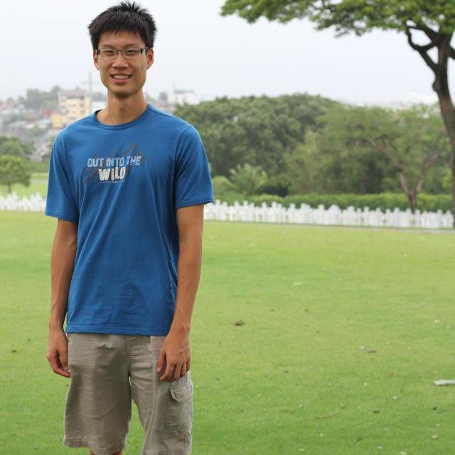

# About Us

<!-- @@LiuYuheng A0139820E -->

We are a team of four Computer Engineering students based in the [School of Computing, National University of Singapore](http://www.comp.nus.edu.sg). 

## Project Team
 
#### [**Low Yong Cheng**](https://github.com/yongchenglow)
**Role**: Team Leader 
Team Leader: responsible for overall project coordination. 
Documentation: ensure quality of various project documents.

-----

#### [**Liu Yuheng**](https://github.com/E0003705)
 

* Components in charge of: 
    * [Storage](https://github.com/CS2103AUG2016-T10-C4/Main/blob/master/docs/DeveloperGuide.md#7-storage-component)
    * [UI](https://github.com/CS2103AUG2016-T10-C4/Main/blob/master/docs/DeveloperGuide.md#4-ui-component)
* Aspects/Tools in charge of: Github, JavaFX, Scenebuilder
* Features implemented:
    * [List Tasks](https://github.com/CS2103AUG2016-T10-C4/Main/blob/master/docs/UserGuide.md#316-listing-what-you-want-to-do)
* Code written:[[functional code](https://github.com/CS2103AUG2016-T10-C4/Main/blob/master/collated/main/A0139820E.md)][[test code](collated/test/A0139820E.md)][[docs](collated/docs/A0139820E.md)]
* Other major contributions:
    * Did the initial refactoring from addressbook to task manager
    * Ensure all test cases able to pass
    * Keep issue tracker up to date

-----

#### [**Eu Jin Marcus Yatim**](https://github.com/a0124453)
 
**Role**: Group member 
Integration: integrate various parts of the software to create a whole. 
Scheduling: in charge of assigning and tracking project tasks.

-----

#### [**Raphael Quek**](https://github.com/raphaelquek)
**Role**: Group member 
Testing: ensures the testing of the project is done properly and on time. 
Code quality: looks after the code quality, ensures adherence to code standards.

-----

#Project Mentor
#### [**Sam Yong**](https://github.com/mauris)
  
 
------

## Contribute

We welcome contributions. See [Contact Us](ContactUs.md) page for more info.
