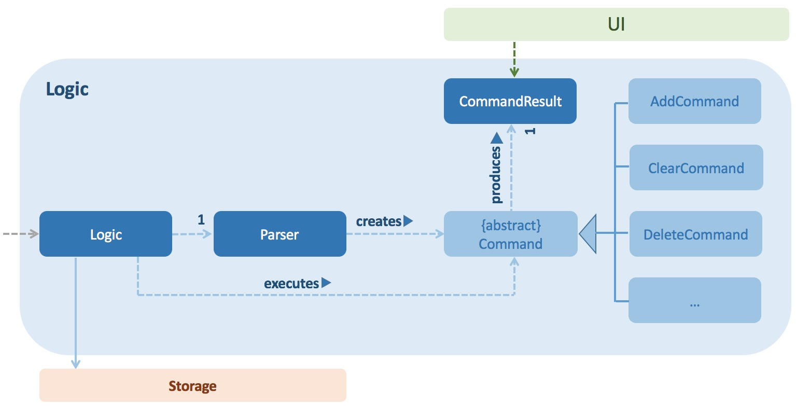
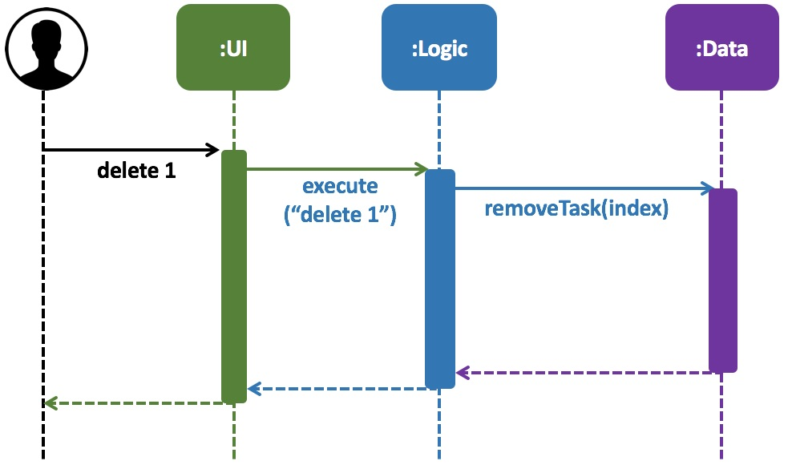
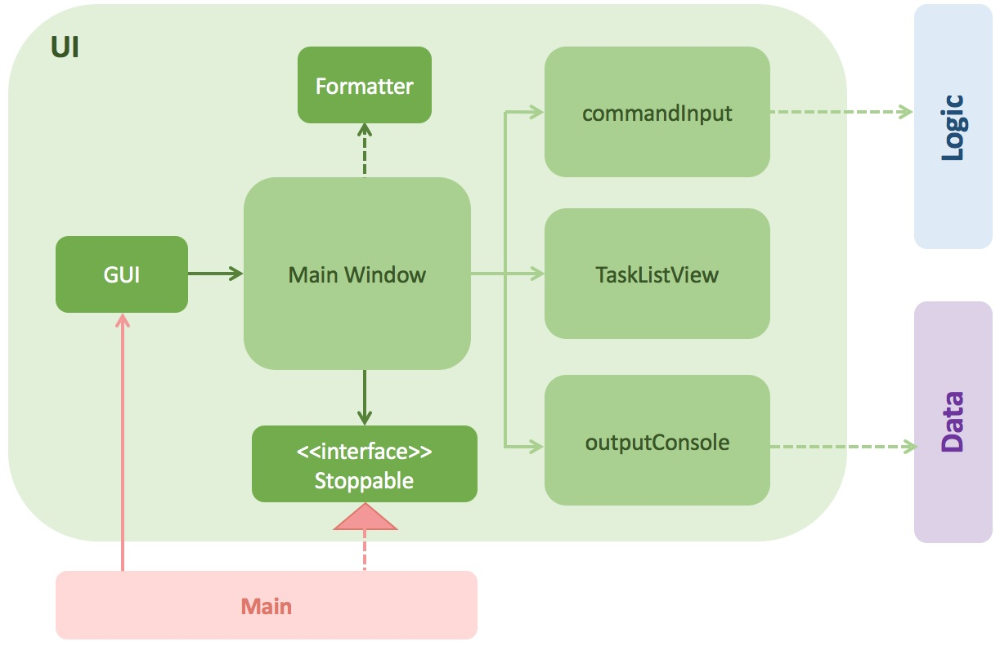
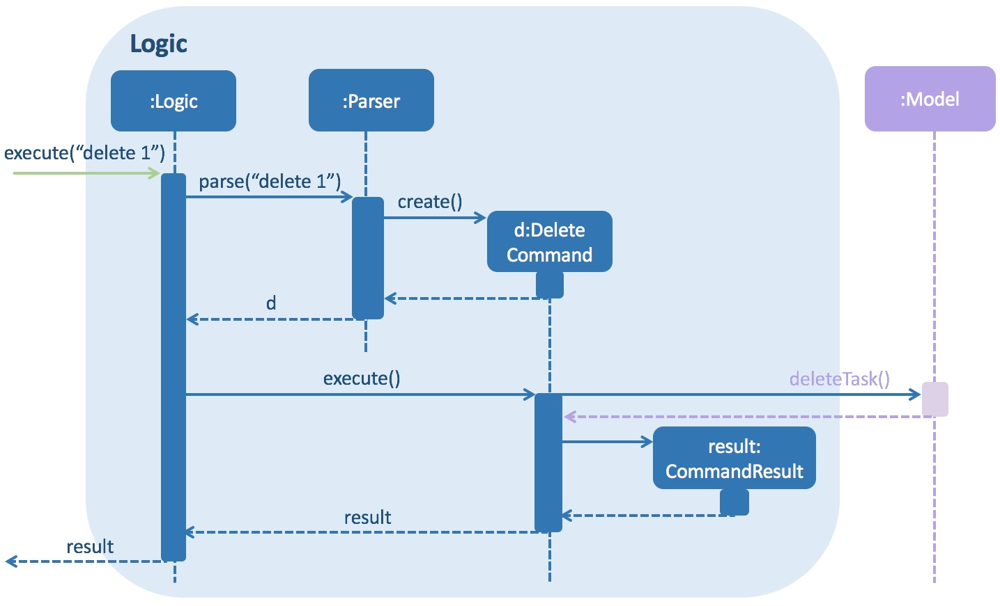
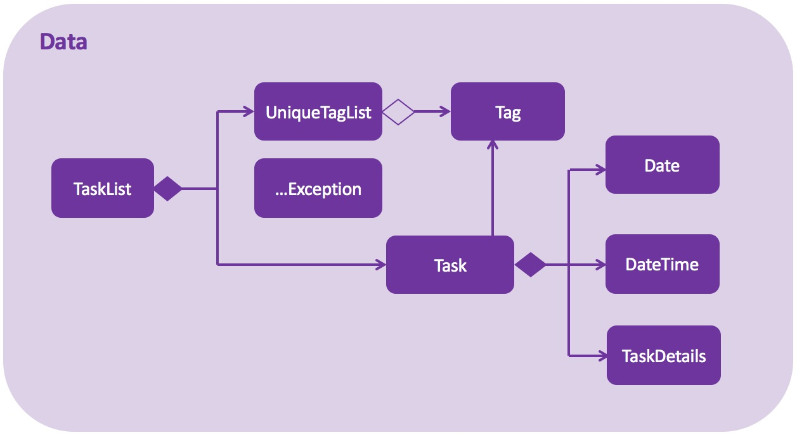
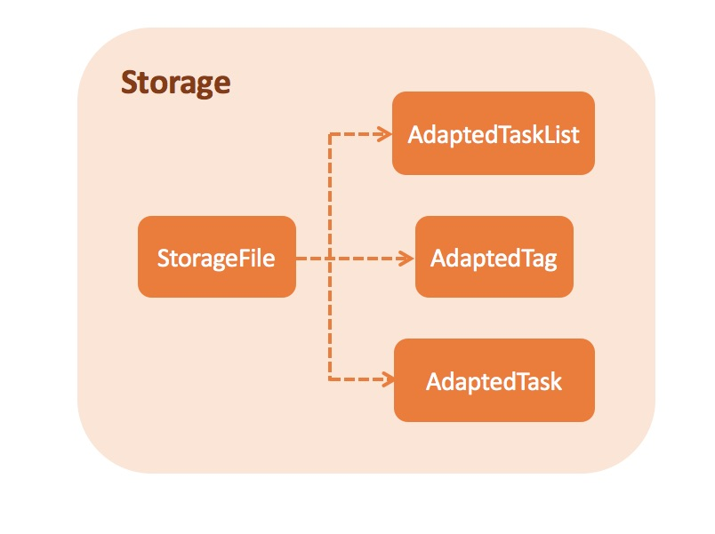

<!-- @@author A0124453M -->

# Developer Guide 

## Table of Contents

* [1. About] (#1-about)
* [2. Setting Up](#2-setting-up)
* [3. Architecture](#3-architecture)
* [4. UI Component](#4-ui-component)
* [5. Logic Component](#5-logic-component)
* [6. Data Component](#6-data-component)
* [7. Storage Component](#7-storage-component)
* [8. Common Classes](#8-common-classes)
* [9. Testing](#9-testing)
* [10. Future Development](#10-future-development)
* [Appendix A: User Stories](#appendix-a-user-stories)
* [Appendix B: Use Cases](#appendix-b-use-cases)
* [Appendix C: Non Functional Requirements](#appendix-c-non-functional-requirements)
* [Appendix D: Glossary](#appendix-d-glossary)
* [Appendix E : Product Survey](#appendix-e-product-survey)

## 1. About

**KeyboardWarrior** is a scheduler and task manager application that accepts short and intuitive commands to provide a quick and convenient way to manage tasks using only the keyboard.

Our target audience are users who receives tasks that are to be scheduled at a later date. It allows the user to schedule, reschedule, update, and delete tasks with just a single command.

This guide describes the design and implementation of **KeyboardWarrior**. It will help you understand how **KeyboardWarrior** works and how you can further contribute to its development. We have organised this guide in a top-down manner so that you can understand the big picture before moving on to the more detailed sections.

## 2. Setting up

### 2.1. Before Using the Application

1. Ensure you have Java version `1.8.0_60` or later installed in your Computer.
	Download the latest version via this [**`link`**](http://www.oracle.com/technetwork/java/javase/downloads/index.html).
   > Having any Java 8 version is not enough.  
   This app will not work with earlier versions of Java 8.

2. Ensure you have Eclipse Integrated Development Environment (IDE).   
    Download the latest version via this [**`link`**](http://download.eclipse.org/eclipse/downloads/).
   
2. Download the latest `KeyboardWarrior.jar` from the [**`releases`**](../../../releases) tab.

3. Copy the file to the folder you want to use as the home folder for your **KeyboardWarrior**.

### 2.2 Import existing project into Eclipse

1. Fork this repository, and clone the fork to your computer.
2. Open Eclipse 
3. Click `File` > `Import`.
4. Click `General` > `Existing Projects into Workspace` > `Next`.
5. Click `Browse`, then locate the project's directory.
6. Click `Finish`.

### 2.3 Troubleshoot

**Problem: Eclipse reports compile errors after new commits are pulled from Git**

* _Reason_: Eclipse fails to recognise new files that appeared due to the Git pull. 
* _Solution_: you have to refresh the project in Eclipse:  
  Right click on the project (in Eclipse package explorer), choose `Refresh`. Or press `F5` on your keyboard.

## 3. Architecture

  
> Figure 1: Architecture Class Diagram

Figure 1 shows the **_Architecture Diagram_** which gives the high-level design of **KeyboardWarrior**. You can refer to the section below to get a quick overview of each component.

`Main` has only one class called [**`Main`**](../src/ruby/keyboardwarrior/Main.java). It has 2 responsibilities:
1. At app launch: Initialises the components in the correct sequence, and connect them up with each other.
2. At shut down: Shuts down the components and invoke cleanup method where necessary.

[**`Common`**](#8-common-classes) represents a couple of classes used by multiple other components. These two classes play important roles at the architecture level.

* `Utils` : This class is used by components to check if there are *Null* entires or if there are *Unique* elements.
* `LogsCenter` : Used by many classes to write visible messages.

The rest of **KeyboardWarrior** is made up of four main components:

* [**`UI`**](#4-ui-component) : The UI of tha App.
* [**`Logic`**](#5-logic-component) : The command executor.
* [**`Data`**](#6-data-component) : Holds the data of the App in-memory.
* [**`Storage`**](#7-storage-component) : Reads data from, and writes data to, the hard disk.

Each of the four components

* Defines its _API_ in an `interface` with the same name as the Component.
* Exposes its functionality using a `{Component Name}Manager` class.

For example, the `Logic` component (see the class diagram given Figure 2) defines its API in the `Logic.java`
interface and exposes its functionality using the `LogicManager.java` class. 
 
 
> Figure 2: Logic Component Class Diagram

The _Sequence Diagram_ in Figure 3 below shows how the components interact for the scenario where the user issues the
command `delete 1`.

 
 
> Figure 3: Delete Task Sequence Diagram

## 4. UI Component

  
> Figure 4: UI Component Class Diagram

**API** : [`GUI.java`](../src/ruby/keyboardwarrior/ui/GUI.java)

The UI consists of a `MainWindow` that is made up of parts `commandInput`, `TaskListView` and `outputConsole`. All these, including the `MainWindow`, is called by the `GUI` class.

The UI component uses the JavaFX UI framework. The layout of [`MainWindow`](../src/ruby/keyboardwarrior/ui/MainWindow.java) is defined in the matching “.fxml” file that is located in `keyboardwarrior/ui/` folder, i.e. [`mainwindow.fxml`](../src/ruby/keyboardwarrior/ui/mainwindow.fxml).

The `UI` component,

* Executes user commands using the `Logic` component.
* Binds itself to some data in the `Data` so that the UI can auto-update when data in the `Data` change.
* Responds to events raised from various parts of the App and updates the UI accordingly.

## 5. Logic Component

  
> Figure 5:  Logic Component Class Diagram

**API** : [`Logic.java`](../src/ruby/keyboardwarrior/logic/Logic.java)

1. `Logic` uses the `Parser` class to parse the user command.
2. The `Parser` class returns a `Command` object which is executed by the `Logic`.
3. The command execution can affect the `Data` (e.g. adding a task) and/or raise events.
4. The result of the command execution is encapsulated as a `CommandResult` object which is passed back to the `Ui`.

Given below, in Figure 6, is the *Sequence Diagram* for interactions within the `Logic` component for the `execute("delete 1")` API call. 

  
> Figure 6: Delete Task Sequence Diagram within Logic Componentm

## 6. Data Component

  
> Figure 7: Data Component Class Diagram

**API** : [`Data.java`](../src/ruby/keyboardwarrior/data/TasksList.java)

The `Data`,

* stores the **KeyboardWarrior** data.
* does not depend on any of the other three components.

## 7. Storage Component

  
> Figure 8: Storage Component Class Diagram

**API** : [`StorageFile.java`](../src/ruby/keyboardwarrior/storage/StorageFile.java)

## 8. Common Classes

You can find all classes used by multiple components in the `keyboardwarrior.common` package.

## 9. Testing

**KeyboardWarrior** uses `JUnit` to perform unit tests on the `UI`, `Backend` and `Data` components. Every method is unit tested to ensure everything works as intended.

You can find the tests in the `./test/java/ruby/keyboardwarrior` folder.

We have two types of tests:

1. **Logic Tests** - {TODO: Add description}
  
2. **Parser Tests** - {TODO: Add description}
  
 
#### Troubleshooting tests
 **Problem: Tests fail because NullPointException when AssertionError is expected**
 * Reason: Assertions are not enabled for `JUnit` tests. 
   This can happen if you are not using a recent Eclipse version (i.e. _Neon_ or later)
 * Solution: Enable assertions in `JUnit` tests as described 
   [here](http://stackoverflow.com/questions/2522897/eclipse-junit-ea-vm-option).  
   Delete run configurations created when you ran tests earlier.

<!-- test -->
<!-- @@author A0139716X -->

## 10. Future Development	

These are several additions that can be made to **KeyboardWarrior**	 to further increase its usefulness and usability.

### **More Commands**

More commands can be added on to the current application. This allows for greater functionality to suit various users.

> Examples:
> * Search for empty slots.
> * Add recurring tasks.
> * Add tags to tasks. 

### **Integration With Other Scheduler Apps**

**KeyboardWarrior** currently does not integrate with any other scheduler apps (e.g. `Google Calender`). This added functionality would be useful to attract current users of the other scheduler apps.

### **Secure Data**

Data could be secured through encryption so that only users can only access their own data to ensure privacy.

<!-- @@author A0139820E -->

## Appendix A : User Stories

**Priorities**: High (must have) - `* * *`, Medium (nice to have)  - `* *`,  Low (unlikely to have) - `*`

Priority | As a ... | I want to ... | So that I can...
-------- | :------- | :--------- | :-----------
`* * *` | new user | see usage instructions | find out how to use the app
`* * *` | basic user | add an event with start and end time| know how long I need to spend on the event
`* * *` | basic user | add a deadline with date and time | decide what needs to be done soon
`* * *` | basic user | add a task with only description | record tasks that needs to be done some day
`* * *` | basic user | list all tasks that were added | can get a overview on all my tasks
`* * *` | basic user | find a specific task | refer to the task details quickly
`* * *` | basic user | edit a task | update the task details when I need to
`* * *` | basic user | delete a task | remove tasks that I no longer need to do
`* * *` | basic user | undo actions made | undo my mistakes quickly
`* * *` | basic user | be able to enter commands differently | have more flexibility in my commands
`* * *` | basic user | specify a folder as the data storage location | have more control on the where the data is stored
`* *` | intermediate user | add priority levels to my tasks | do more urgent tasks first
`* *` | intermediate user | clear all task that are completed | remove them at once instead individually
`* *` | intermediate user | add tags to my tasks | organize my tasks into different categories
`* *` | intermediate user | list all completed tasks | remove them if needed
`* *` | intermediate user | list all incomplete tasks | check on my progress
`* *` | intermediate user | see a list of commands I have added before | trace my action if needed
`* *` | intermediate user | redo an undone command | do not need to manually type out the changes if needed
`* *` | intermediate user | pin a tasks | keep important tasks at the top
`* *` | intermediate user | check time remaining | find out how much time remaining without manually calculating
`* *` | intermediate user | search for empty slots | I can find suitable slots to put in new tasks
`*` | advanced user | add weekly recurring tasks | do not need to add them individually
`*` | advanced user | sort my tasks in a specific order ( e.g. by priority, by date, by alphabetical) | easily find tasks in sequence
`*` | advanced user | see statistics on my tasks | know how many tasks I completed and did not complete
`*` | advanced user | reserve slots | avoid using the slots by mistake

<!-- @@author A0139820E -->

## Appendix B : Use Cases

`Software System:` **KeyboardWarrior**  
`Use case:` UC01 - Adding a calendar task  
`Actor:` User  
`MSS:`  
1. User chooses to add a calendar task.  
2. User types in command and required parameters.  
3. **KeyboardWarrior** displays task in Calendar pane.  
`Use case ends.`  
`Extensions:`  
2.a. **KeyboardWarrior** detects an error in the entered parameters.  
2.a.1. **KeyboardWarrior** requests for the correct parameters.  
2.a.2. User enters new parameters.  
Steps 2.a.1 - 2.a.2 are repeated until the parameters entered are correct.  
Use case resumes from step 3.  
`Use case ends.`  

--

`Software System:` **KeyboardWarrior**  
`Use case:` UC02 - Finding a task  
`Actor:` User  
`MSS:`   
1. User chooses to find a task.  
2. User types in command and required parameters.  
3. **KeyboardWarrior** displays task on Calendar pane.  
`Use case ends.`  
`Extensions:`  
2.a. **KeyboardWarrior** does not find searched task.  
2.a.1. **KeyboardWarrior** notifies user that there is no such task.  
`Use case ends.`  

--

`Software System:` **KeyboardWarrior**  
`Use case:` UC03 - Complete todo task  
`Actor:` User  
`MSS:`  
1. User chooses to complete a Keep in View or Deadline.  
2. User types in command and required parameters.  
3. **KeyboardWarrior** removes task from Todo pane or Deadline pane.  
`Use case ends.`  
`Extensions:`  
2.a. **KeyboardWarrior** does not find searched task.  
2.a.1. **KeyboardWarrior** notifies user that there is no such task.  
`Use case ends.`  

<!-- @@author A0139820E -->

## Appendix C : Non Functional Requirements

* Should work on computers without internet connection.
* Should be fully CLI capable with keyboard shortcuts for mouse interactions.
*  Should work standalone in any mainstream operating system (OS) with Java 8 or higher installed.
* Should store data only in a human editable text file.
* Should be coded in OOP format.
* Should be able to hold at least 1000 individual task entries.
* Should take up less than 10mb storage space.
* Should come with automated unit tests and open source codes.
* Should work without any installer.
*  Should be able to process task efficiently by using efficient searching algorithms.
* Should be able to support command line interface.

<!-- @@author A0139820E -->

## Appendix D : Glossary

##### Mainstream OS

> Windows, Linux, Unix, OS-X

{TODO: Add more terms to Glossary}

## Appendix E : Product Survey

{TODO: Compare pros and cons}

####Google calendar
1.	Users can create multiple calendars for different usages.
2.	Contains a world clock feature
3.	Allows for specific location to be added to the events. (In the case of multiple possible locations for a place, e.g. Macdonald's)
4.	Pop up notifications for coming up events.
5.	'Find a time' feature to automatically look for empty slots for planning an event.
6.	Countdown timer popup window.
7.	Allows users to share their calendars with one another.
8.	Users can sync or import other calendar applications with google calendars to create a master calendar.

####Todo.txt
1.	A simple app that saves all task into a single "todo.txt" file
2.	Supports command line inputs (CLI)
3.	Allows grouping of related tasks into one project
4.	Allows for priority to be set to tasks and tasks will auto arrange themselves according to their priority
5.	Able to mark tasks as complete

####Fantastical 
1.	Supports syncing with other calendar apps such as Google Calendar.
2.	When scheduling a group event, allows you to quickly find out if coworkers are available during that duration (provided coworkers are using supported Calendar apps).
3.	Has a quick access 'mini-window' for your convenience.
4.	Has separate calendar sets based on your needs, e.g Leisure Calendar, Work Calendar, etc.
5.	Able to write in natural language style.
6.	Allows Day, Week, Month and Year views.
7.	Users can type in various languages such as Spanish or Japanese.

####Any.do Cal
1.	Supports syncing with other calendar apps such as Google Calendar
2.	Specializes only in showing your daily agenda with minimal clutter
3.	Allows Syncing with any-do so that your to-do list is also imported into the calendar.
