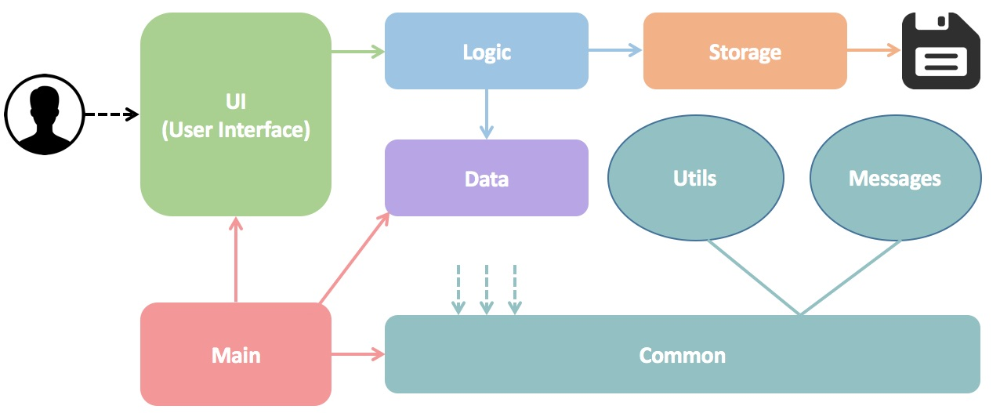

# Developer Guide 

## Table of Contents

* [Introduction] (#introduction)
* [Setting Up](#setting-up)
* [Architecture](#architecture)
* [UI Component](#ui-component)
* [Backend Component](#backend-component)
* [Data Component](#data-component)
* [Implementation](#implementation)
* [Testing](#testing)
* [Future Development](#future-development)

## Introduction

**KeyboardWarrior** is an intuitive task manager that will help you manage your schedule and todo tasks. This advance tool is a Java desktop application that has a UI and can accept natural language commands via keyboard.  

This guide describes the design and implementation of **KeyboardWarrior**. It will help you understand how **KeyboardWarrior** works and how you can further contribute to its development. We have organised this guide in a top-down manner so that you can understand the big picture before moving on to the more detailed sections.

## Setting up

#### Prerequisites

You will have to:

1. Have **JDK `1.8.0_60`**  or later.  

    > Having any Java 8 version is not enough.  
    This app will not work with earlier versions of Java 8.
    
2. Have the latest version of **KeyboardWarrior** downloaded.  

#### Running KeyboardWarrior

1. Copy the downloaded files to the folder you want to use as the Home folder for your **KeyboardWarrior**.
2. Double-click the file to start the app.

## Architecture

  
> Figure: The **_Architecture Diagram_** given above explains the high-level design of the App. 

**KeyboardWarrior** is made up of four main components. You can interact with the app primarily through the command line interface (CLI).

The **`UI`** component consists of JavaFX's FXML files which define the layout that is displayed to you, how you interact with it through CLI and the Java files which control these FXML files. 

The **`Backend`** component contains all the logic needed to parse your commands, store collated data into individual files, etc.

The **`Data`** component represents objects involved in the collation of source files such as the authors of the project and code snippets that were written.

The **`Test Driver`** component tests the `UI`, `Backend` and `Data` components. It utilises `JUnit` for unit testing.

The sections below give more details of each component.

## UI Component

{TODO: Insert UI image}

> Figure: Structure of the `UI` Component.

{TODO: Add UI Component outline}

## Backend Component

{TODO: Insert Backend image}

> Figure: Structure of the `Backend` Component.

{TODO: Add Backend Component outline}

## Data Component

{TODO: Insert Data image}

> Figure: Structure of the `Data` Component.

{TODO: Add Data Component outline}

## Implementation

{TODO: Add implementation outline}

## Testing

**KeyboardWarrior** uses `JUnit` to perform unit tests on the `UI`, `Backend` and `Data` components. Every method is unit tested to ensure everything works as intended.

You can find the tests in the `./test/java/ruby/keyboardwarrior` folder.

We have two types of tests:

1. **Logic Tests** - {TODO: Add description}
  
2. **Parser Tests** - {TODO: Addd description}
  
 
#### Troubleshooting tests
 **Problem: Tests fail because NullPointException when AssertionError is expected**
 * Reason: Assertions are not enabled for `JUnit` tests. 
   This can happen if you are not using a recent Eclipse version (i.e. _Neon_ or later)
 * Solution: Enable assertions in `JUnit` tests as described 
   [here](http://stackoverflow.com/questions/2522897/eclipse-junit-ea-vm-option).  
   Delete run configurations created when you ran tests earlier.
  
## Future Development	

These are several additions that can be made to **KeyboardWarrior**	 to further increase its usefulness and usability.

{TODO: Add future development plans}
