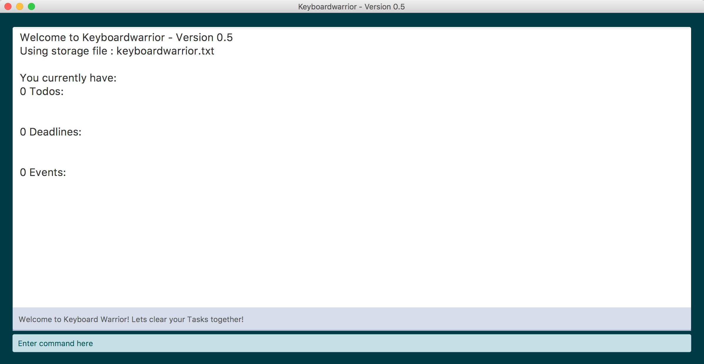

<!-- @@author A0124453M -->

# User Guide

* [About Our Product](#1-about-our-product)
* [Getting Started](#2-getting-started)
* [Features](#3-features)
* [Command Summary](#4-command-summary)
* [Frequently Asked Questions (FAQ)](#5-frequently-asked-questions-faq)
* [Glossary](#6-glossary)

 

<!-- @@author A0139716X -->

## 1. About Our Product
 
KeyboardWarrior is a scheduler and task manager application that accepts short and intuitive commands to provide a quick and convenient way to manage tasks using only the keyboard.

It allows you to schedule, reschedule, update, and delete tasks with just a single command. You will no longer have to rely on your fallible memory to manage your schedule.

 

<!-- @@author A0124453M -->

## 2. Getting Started
 
### 2.1. Before Using the Application
 
1) Ensure you have Java version `1.8.0_60` or later installed in your Computer.
	Download the latest version via this [**`link`**](http://www.oracle.com/technetwork/java/javase/downloads/index.html).
   > Having any Java 8 version is not enough.  
   This app will not work with earlier versions of Java 8.
         
2) Download the latest `KeyboardWarrior.jar` from the [releases](../../../releases) tab.

3) Copy the file to the folder you want to use as the home folder for your **KeyboardWarrior**.

 
### 2.2. Launching the Application
 
Double-click the file to start the app. The GUI should appear in a few seconds.   
      
   
### 2.3. Entering Commands
 
Type the command in the command box and press <kbd>Enter</kbd> to execute it.

<!-- @@author A0144665Y -->

Some example commands you can try:

   * **`help`** : Opens the help window.
   * **`add`**` Do CS2103 Tutorial` : 
     Adds a To-do task `Do CS2103 Tutorial` to KeyboardWarrior.
   * **`delete`** `1` : Deletes the 1st task shown.
   * **`exit`** : Exits the app.
   
Refer to the [Features](#3-features) section below for details of each command.

 

<!-- @@author A0139716X -->

## 3. Features
 
To understand the following command formats, you can refer to these rules below:

 
1) Words that are **bold** are *commands*.

> E.g. Format for adding Deadline: **`add`** `DEADLINE by DATE TIME`
> 
> The word **`add`** here is the command that determines the action to be done.

 
2) Words in UPPERCASE are the *parameters*.
     
> E.g. Format for adding Deadline: **`add`** `DEADLINE by DATE TIME`
> 
> The words `DEADLINE`, `DATE` and `TIME` here are the parameters that represents the details of the Deadline item to be created. They should be replaced by what you want the details to be. For example, `DATE` should be replaced by a specific date of the Deadline. 

  
3) The order of the format must be strictly adhered to.

 
4) You can include *tags* in any of the tasks which you wish to add by using the `#` key. These tags can help you classify or identify unique tasks in your **KeyboardWarrior**. Tags are optional and are indicated in square brackets, i.e. [ ].

 
### 3.1.1. Viewing Help 
 
**Format:** **`help`** 

This will load the help window which will show all the available commands that can be used in **KeyboardWarrior**. 

It will help you learn about the commands if you are a new user or you can refer to a command's exact function and format when needed.

<!-- @@author A0144665Y -->

 
**Example:**

**`help`**

> Displays a menu that gives the command summary. 

 
At any time, **KeyboardWarrior** also allows you to view the specific instructions for a particular command just by simply typing it down without any parameters.

 
**Example:**

**`add`**

> Displays a menu that gives the specific instruction for the **`add`** command.

<!-- @@author A0124453M -->

 
### 3.1.2. Add a To-do Task
 
**Format:** **`add`** `TODO [#tag]`

This adds a Todo to the schedule in **KeyboardWarrior**. A Todo is a kind of task that needs to be done by no specific deadline. It only contains a description of the task. 

It is useful for things that you might want to do in the near future but do not have a strict deadline for completion, e.g. reading a book for leisure.

 
**Parameter usage:**
 
`TODO`

> The `TODO` parameter should be the name or a short description of the To-do to be created.	

 
**Examples:**

**`add`** `Buy chocolate milk`

> Creates a new Todo with the description 'Buy chocolate milk'.

**`add`** `Read "Art of War" #leisure`

> Creates a new Todo with the description 'Read "Art of War"' and attach a #leisure tag to it.

 
### 3.1.3. Add a Deadline
 
**Format:** **`add`** `DEADLINE by DATE TIME [#tag]`

This adds a Deadline to the schedule in **KeyboardWarrior**. A Deadline is a kind of task that has to be completed by a specific deadline. Hence the date and time of the deadline should be specified in the command in addition to its description. 

This is suitable for most work-related tasks as they are usually scheduled within a certain timeframe to meet clients demands, e.g. proposal submissions. 

  
**Parameter usage:**

`DEADLINE`

> The `DEADLINE` parameter should be the name or a short description of the Deadline to be created.

`DATE`

> The `DATE` parameter represents the specific day of the deadline.
> 
> Acceptable format:
>  
> DDMMYY format.
>  
>      E.g. 160417 represents the date April 16, 2017.
> 
> The `DATE` parameter must be preceded by the word `by`.
 
`TIME`
 
> The `TIME` parameter represents the specific time of deadline.
>  
> Acceptable format:
> 
> 24-hour clock format
>  
>      E.g. 2030 represents the time 8:30 p.m.

<!-- @@author A0144665Y -->

 
**Examples:** 

**`add`** `Submit invoice by 171016 1700`

> Creates a new Deadline with the description 'Submit Invoice' and a deadline on 17 October 2016, 5:00 p.m.

**`add`** `Complete tutorial by 171016 1800 #homework`

> Creates a new Deadline with the description 'Complete tutorial' and a deadline on 17 October 2016, 6:00 p.m. Also adds a #homework tag to it.

<!-- @@author A0139716X -->

 
### 3.1.4. Add an Event
 
**Format:** **`add`** `EVENT from STARTDATE STARTTIME ENDDATE ENDTIME [#tag]`

This adds an Event to the schedule in **KeyboardWarrior**. An Event is an activity that occurs between a set of specific date and time.  

This is suitable for things you might have to attend at a particular time with specific end times, e.g. meetings, or without, e.g. birthday parties. 

 
**Parameter usage:**

`EVENT`
 
> The `EVENT` parameter should be the name or a short description of the Event to be created.

`STARTDATE` and `ENDDATE`
 
> The `STARTDATE` parameter represents the day the Event starts on.
> 
> The `ENDDATE` parameter represents the day the Event ends on.
>  
> Both the `STARTDATE` and `ENDDATE` parameters follows the same format as the `DATE` parameter specified in *3.1.3. Add Deadline Task*.
> 
> The `STARTDATE` parameter must be preceded by the word `from`.

`STARTTIME` and `ENDTIME`
 
> The `STARTTIME` parameter represents the start time of the Event. 
>  
> The `ENDTIME` parameter represents the end time of the Event. 
>  
> Both the `STARTTIME` and `ENDTIME` parameters follows the same format as the `TIME` parameter specified in *3.1.3. Add Deadline Task*.
 
 
**Examples:** 

**`add`** `Group meeting at I3 MR9 from 051016 1410 051016 1600`

> Creates a new Event 'Group meeting at I3 MR9' with the time period as 5 October 2016, 2:10 p.m. to 4:00 p.m. 

**`add`** `Basketball practice from 051016 1800 051016 2100 #basketball`

> Creates a new Event 'Group meeting at I3 MR9' with the time period as 5 October 2016, 6:00 p.m. to 9:00 p.m. Also adds a #basketball tag to it.

 
### 3.1.5. Find an Item
 
**Format:** **`find`** `KEYWORD`

This allows you to find all Todos, Deadlines and Events in **KeyboardWarrior** that contains the phrase that is indicated.

 
**Parameter usage:**
 
`KEYWORD`

> The `KEYWORD` parameter indicates the word to be searched for in the descriptions of Todos, Deadlines and Events in **KeyboardWarrior**. It is important to note that the `KEYWORD` is not case-sensitive.

<!-- @@author A0144665Y -->

 
**Examples:**

**`find`** `basketball`

> Displays all items with the keyword "basketball" found in the description. 

**`find`** `BasKetBall`

> Similarly, this displays all items with the keyword "basketball" found in the description. 

<!-- @@author A0124453M -->

 
### 3.1.6 Listing What You Want To Do
 
**Format:** **`list`**

This command will show you the entire list of your Todos, Deadlines and Events on the screen.

**Example:**

**`list`**

> Lists out all your Todos, Deadlines and Events.

 
**Format:** **`list todo`**

If you only want to see your Todos on the screen, enter the **`list todo`** command.

**Example:**

**`list todo`**

> Lists out all your Todos.

 
**Format:** **`list deadline`**

If you only want to see your Deadlines on the screen, enter the **`list deadline`** command.

**Example:**

**`list deadline`**

> Lists out all your Deadlines.

 
**Format:** **`list event`**

If you only want to see your Events on the screen, enter the **`list event`** command.

**Example:**

**`list event`**

> Lists out all your Events.

 
### 3.1.7. Deleting Items
 
**Format:** **`delete`** `INDEX`

This command will delete the item of the specified index from **KeyboardWarrior**. 

This may be used for Todos that were mistakenly added, Deadlines that have been completed or Events that have passed. You can delete Todos, Deadlines and Events.

The specific list for Todos/ Deadlines/ Events (as according to *3.1.6 Listing What You Want To Do*) must be displayed before using this command.

**Parameter Usage:**
 
`INDEX`

> The `INDEX` refers to the index number corresponding to the listed item shown on **KeyboardWarrior**.

 
**Example**: 

**`delete`** `4` 

> The task with index number 4 is removed from the list. 

 
### 3.1.8. Clearing Everything
 
**Format:** **`clear`**

This command will remove all Todos, Deadlines and Events from **KeyboardWarrior**. 

This is especially useful if you would like to start on a clean slate and thus do not need to go through the hassle of deleting all your previous items.

**Example:**

**`clear`**

> The entire list of Todos, Deadlines and Events is removed from **KeyboardWarrior**.

 
### 3.1.9. Undoing your Previous Commands
 
**Format:** **`undo`**

Each time you enter **`undo`**, the previous command which you had just entered will undo itself. You can key in **`undo`** multiple times and it will continue to undo your typed commands in order of occurance. Of course, when you have no more commands to undo, **`undo`** will not work anymore. 

This command is especially useful when you find yourself entering in wrong items and wish to take them back.

**Example:**

**`undo`**

> Undos the previous command which you had just entered.

### 3.1.10. Exiting the Program 
 
**Format:** **`exit`**  

This command exits the program, all your events and task inside your calendar will be saved.

 
### 3.2 Saving the data 
Calendar data in **KeyboardWarrior** are saved in the hard disk automatically after any command that changes the data.

There is no need to save manually.

      
  
## 4. Command Summary
 

Command | Format  
-------- | :-------- 
Help | **`help`**
Add (Todo)| **`add`** `TODO [#tag]`
Add (Deadline)| **`add`** `DEADLINE by DATE TIME [#tag]`
Add (Event) | **`add`** `EVENT from STARTDATE STARTTIME ENDDATE ENDTIME [#tag]`
Find | **`find`** `KEYWORD`
List (all)| **`list`**
List (Todo) | **`list todo`**
List (Deadline) | **`list deadline`**
List (Event) | **`list event`**
Delete | **`delete`** `INDEX`
Clear | **`clear`**
Undo | **`undo`**
Exit | **`exit`**

 

<!-- @@author A0124453M -->

## 5. Frequently Asked Questions (FAQ)
 

**Q**: How do I transfer my data to another Computer?

**A**: Install the app in the other computer and overwrite the empty data file it creates with 
       the file that contains the data of your previous **KeyboardWarrior** folder.

        

<!-- @@author A0139716X -->

## 6. Glossary
 

**GUI (Graphical User Interface):**  
> The visual elements that allow a user to interact with **KeyboardWarrior** on their computer.

**Parameter:**  
> A characteristic detail of the task that is input by the user.

**Overwrite:**  
> Replacing old data with new data.

**Calendar:**  
> A list of items by date within a specified timeframe.

**Todo:**  
> A task that requires completion by no specific deadline.

**Deadline:**  
> A task that requires complete by a specific deadline.

**Event:**  
> A significant happening or activity that occurs within a specific timeframe.
